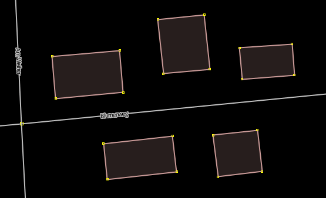

# HouseNumberClick

HouseNumberClick is a JOSM plugin for fast, street-focused house-number tagging on buildings.

## What's New in 1.1.4

- Street dialog wording is now more consistent and clearer across display options.
- Updated option names in UI and docs (for example `Auto-zoom to selected street`, `Show house number labels`, `Show all street counts`).
- Improved usage guidance with plugin icon and explicit auto-increment note.

## Who This Is For

- Mappers who assign many addresses on one street in a focused workflow.
- Users who want fast apply/readback behavior with optional visual analysis overlays.

## Compatibility

- Java: **17+** (build uses `javac --release 17`).
- JOSM minimum main version: `19481` (see `Plugin-Mainversion` in `build.xml`).

## Demo



## Core Features

- Working dialog with `Street`, `Postcode`, optional `Building type`, `House number`, and increment (`-2`, `-1`, `+1`, `+2`).
- Postcode is selected from detected values in the current area (dropdown), but manual entry is also possible for new values.
- Postcode must be set before apply; empty postcode blocks address apply to reduce accidental wrong tagging.
- Left-click applies `addr:street`, `addr:postcode`, optional `addr:housenumber`, and optional `building=*`.
- House number auto-advances after successful apply, including suffix handling (`12a -> 12b`).
- `Ctrl+Click` reads existing address values from buildings; if no building is hit, nearby street name can be read.
- Conflict warning protects against unintended overwrite of existing address data.
- Optional `Auto-zoom to selected street` zooms to mapped house-number buildings of the selected street.

## Split and Row-House Tools

- `Split building`: activate line split mode and drag a line across one building.
- `Create row houses`: activate click mode and click inside a building to split into `Parts`.
- No preselection is required for either flow; the target building is resolved from the drawn line/click.
- `Make rectangular` can orthogonalize line-split results after a successful split.
- Split mode buttons show current state (`ON`) while active.
- Line split remains active after failed attempts and exits only after a successful split (or explicit cancel).

## Map Mode Shortcuts

- `+` / `-`: change current house-number component.
- `L`: toggle suffix (`12 <-> 12a`).
- `Esc`: leave/pause Street Mode.
- `S`: start `Split building`.
- `C`: start `Create row houses`.
- Left/right street navigation is disabled while typing in text fields.

## Split Mode Controls

- **Line split mode:** press left mouse button, drag, and release to attempt split.
- **Terrace (row-house) mode:** click inside building to split into current `Parts`.
- In terrace mode, number keys (`0-9`/numpad) set parts directly (minimum is `2`) and rerun split on the current building.
- In terrace mode, `Esc` exits back to normal Street Mode.

## Optional Visual Tools

- `Show house number labels`: overlay of house numbers for the selected street.
- `Show connection lines`: connects mapped numbers in sorted order; `Separate even / odd` splits parity paths.
- Duplicate house numbers are highlighted in the overlay.
- `Show overview panel (selected street)`: odd/even table with gap markers (`•` for missing base numbers); table click zooms to target object(s).
- `Show all street counts`: list of all known streets and current counts; row click zooms to selected street.
- `Show overview` / `Hide overview`: building-only overview layer:
  - green = `addr:housenumber` present on building object,
  - subtle yellow/ochre = likely misplaced housenumber on multipolygon outer way,
  - dark gray = no housenumber found.


## Usage

1. Start  `HouseNumberClick` in JOSM.
2. Select street and set postcode (from list or manual input), then optional building type/house number.
3. Click buildings to apply addresses. House number increments automatically after each successful click.
4. Optional: use split tools (`Split building`, `Create row houses`) for geometry workflows.
5. Use shortcuts and optional overview windows as needed.


## Troubleshooting

- **No postcode selected:** choose a postcode from the dropdown or type one manually; apply is blocked while postcode is empty.
- **No building detected:** zoom in and click directly on a closed `building=*` object.
- **Overwrite warning appears:** existing address values differ; confirm to overwrite or cancel to keep existing tags.
- **Line split does not run:** draw the line so it clearly crosses one building (not only touching one edge/corner).
- **Line split fails with multiple targets:** avoid crossing two buildings; touching another building edge can still work, but crossing two buildings cannot be resolved uniquely.
- **Create row houses fails:** ensure `Parts >= 2` and click inside a closed `building=*` geometry.
- **Unexpected click failure:** retry once and check JOSM log output if the status line says address click failed.

## Build and Test

```bash
ant clean
ant test
ant dist
```

Artifacts:
- Main plugin jar: `dist/HouseNumberClick.jar`
- Versioned release jar: `dist/HouseNumberClick-<version>.jar` (via `ant release-artifact`)

## Local Installation

```bash
mkdir -p ~/.josm/plugins
cp dist/HouseNumberClick.jar ~/.josm/plugins/
```

## PluginsSource-First Release (GitHub Hosted Jar)

1. Set release version in `build.xml` (`plugin.version`).
2. Build release artifacts:

```bash
ant clean
ant test
ant release-artifact
```

3. Create Git tag `v<version>` and GitHub release.
4. Upload `dist/HouseNumberClick-<version>.jar` as release asset.
5. For PluginsSource, use the direct GitHub release asset URL pattern:
   - `https://github.com/<owner>/<repo>/releases/download/v<version>/HouseNumberClick-<version>.jar`

## License

GNU General Public License v2. See `LICENSE`.
